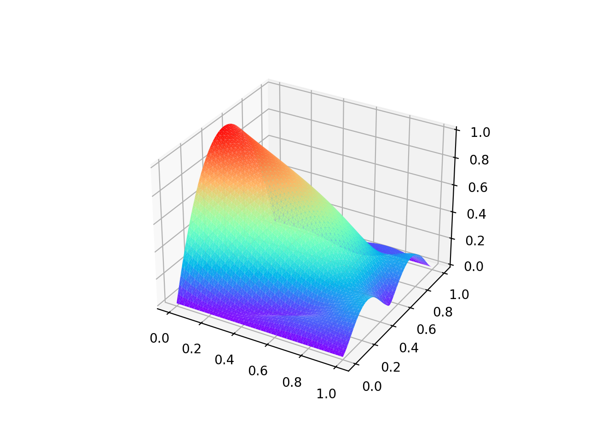
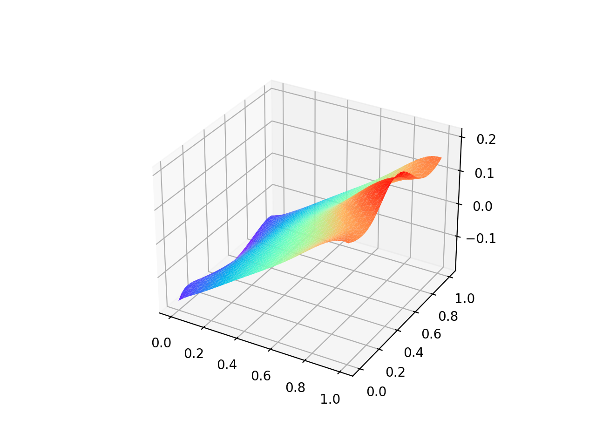
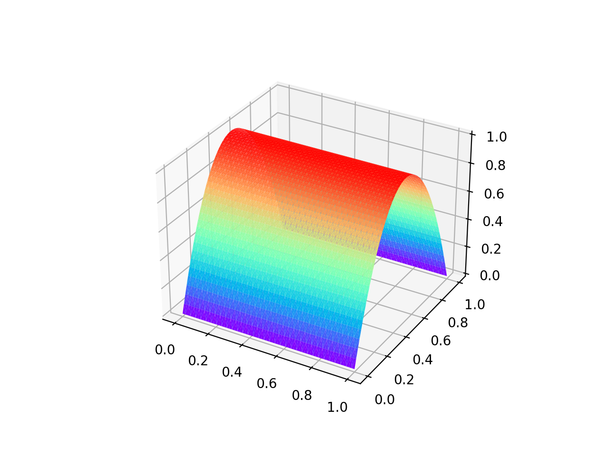
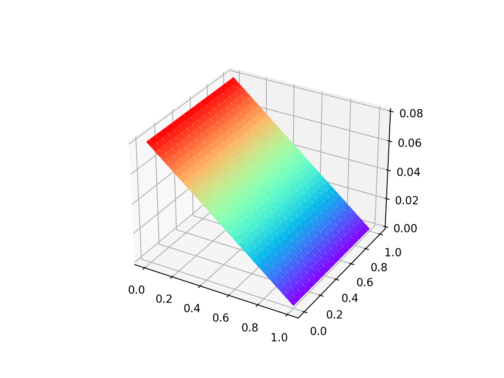

1. 在运行 `FEMVC_NavierStoke_channel.py` 时, 压力的处理方式很重要, 我们在程序中采用 `压力的积分等于 0` 这种方式来处理时, 得到了错误的速度和压力, 如下图

   错误的速度图

错误的压力图


2. 而当我们给定压力最右边的值为 $0$ 时, 对压力 $p$ 也直接采用 Dirichlet 边的形式进行处理

   程序的代码如下 

   ```python
   # # Method II: Using the Dirichlet boundary of pressure
   	def dir_pressure(p):
   		return pde.pressure_dirichlet(p, next_t)
   	bc = DirichletBC(pspace, dir_pressure, threshold=idxOutFlowEdge)
   	plsm_temp, prv = bc.apply(plsm.copy(), prv)
   	next_ph[:] = spsolve(plsm_temp, prv).reshape(-1)
   ```

   最终可以得到正确的结果

   正确的速度图

   正确的压力图


